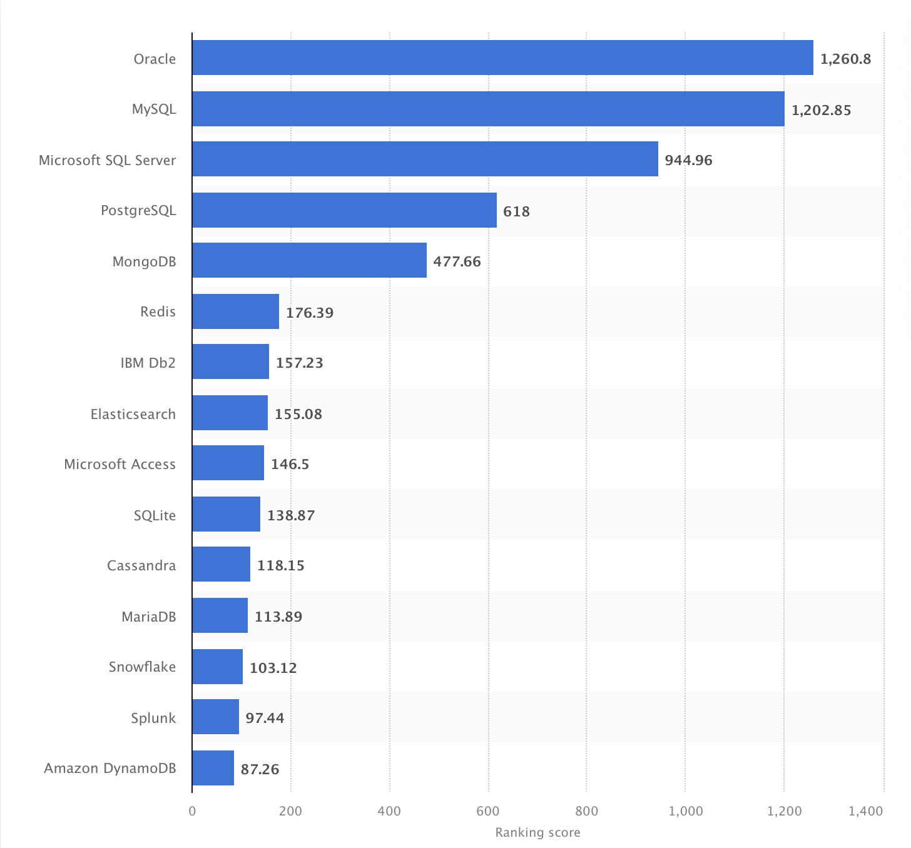

<!-- Tarea 1. Preliminares-->

# Base de Datos y sus relaciones de manera no estructurada. 

Una *base de datos* es un tipo de tecnologia para el almacenamiento de datos. 

>Utilizamos bases de datos como fuente principal de datos, ayudándonos a compartirlos entre las diferentes partes de nuestras aplicaciones.
En lugar de encontrar una manera de almacenar y recuperar información e inventar un nueva forma de organizar los datos cada vez que creamos una nueva aplicación, usamos bases de datos

Los datos comunmente se describen como estructurados o no estructurados, o a veces como semiestructurados. 

### **Datos Estructurados**
En los datos estructurados -siguiendo un modelo de datos especifico y de tipo de datos-, cada atributo es almacenado en una columna y las instancias de cada entidad se representan como filas. Los datos estructurados son fáciles de consultar con SQL.
### **Datos No Estrcturados**
Los datos no estructurados son lo opuesto a los datos estructurados. No hay una estructura, modelo de datos o tipos de datos predeterminados.
No encajan en los tipos de datos tradicionales y, por lo tanto, son más difíciles de almacenar de manera eficiente para las bases de datos relacionales y para que SQL las consulte.
#### *Ejemplos de Datos No Estrcturados*
>Documentos, correos electrónicos, páginas web, fotos, imágenes, videos y archivos de audio son ejemplos de datos no estructurados. 

## **Sistema Gestor de Bases de Datos**
Un *sistema gestor de base de datos (SGBD)* es un software que permite crear y administrar bases de datos, asi como gestionar la informacion que contienen. 

>   El trabajo principal de cualquier sistema gestor de bases de datos es almacenar datos de manera confiable y ponerlos a disposición de los usuarios.

*Ranking de los sistemas de gestión de bases de datos más populares a nivel mundial, a Agosto de 2022*

### **MySQL**